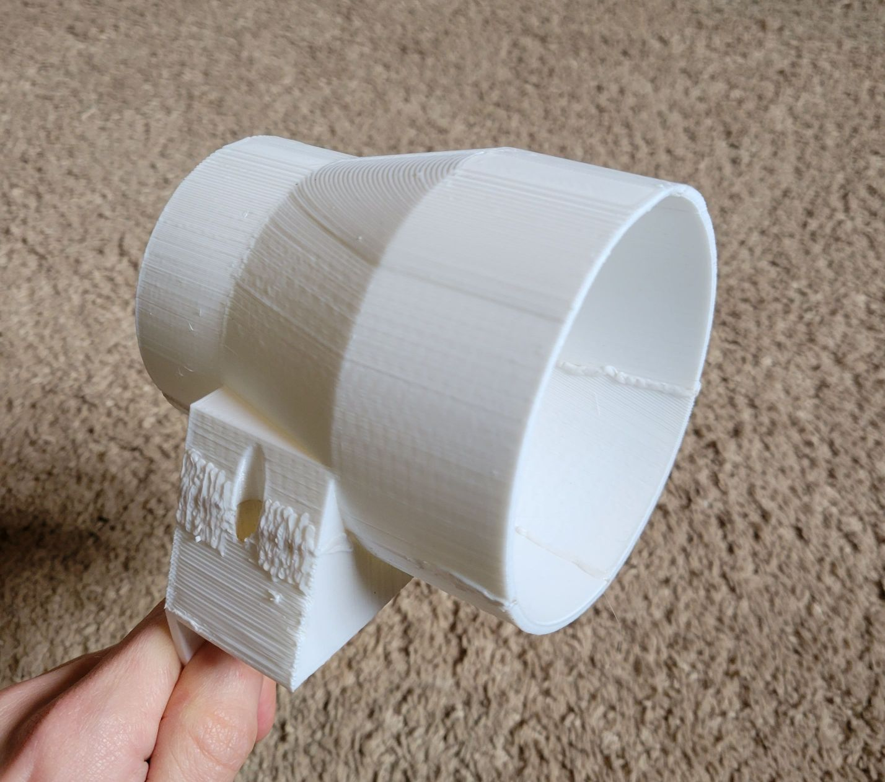
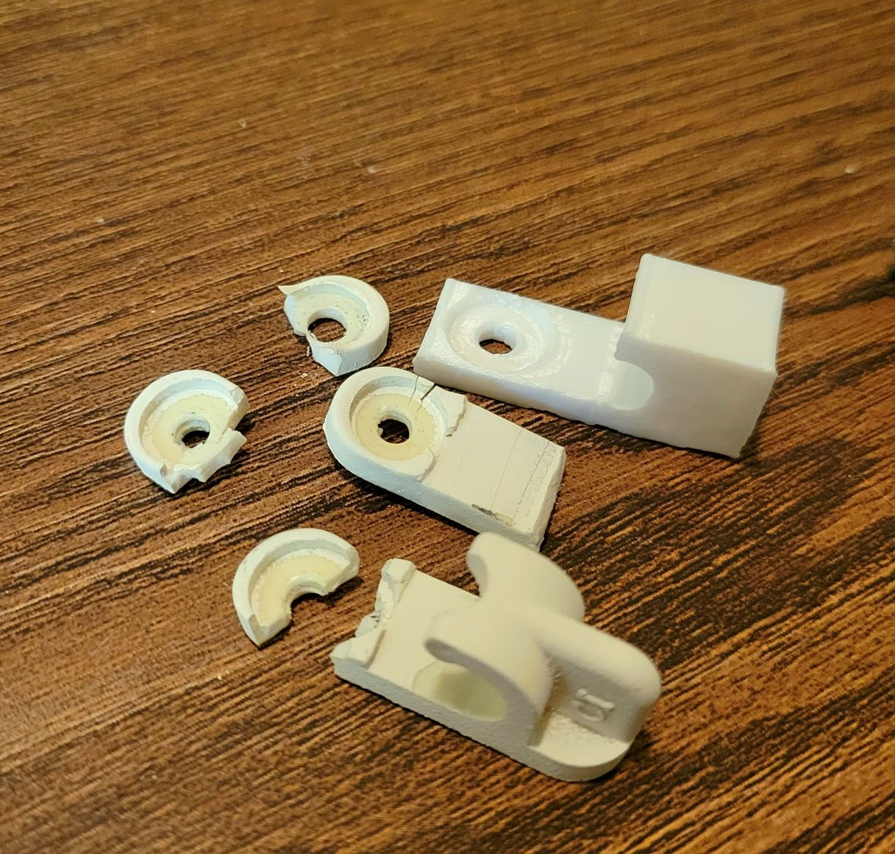
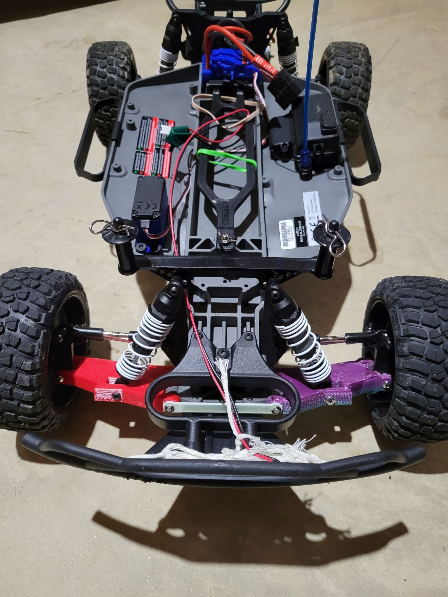
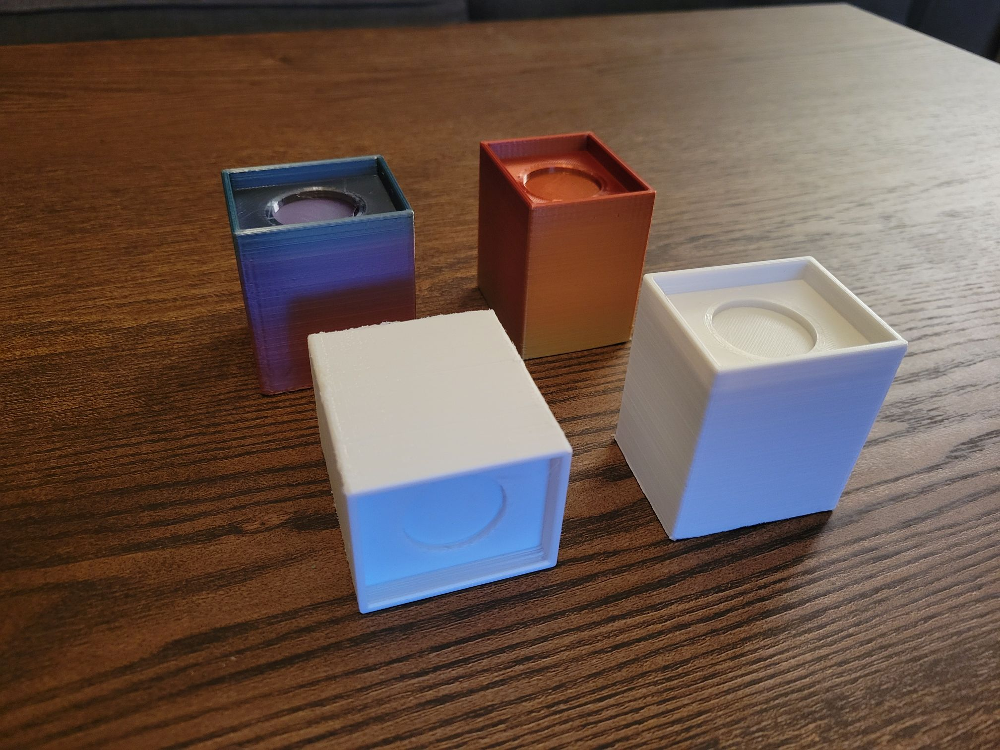

# OpenSCAD_Designs  
3D models designed in OpenSCAD, intended for 3D printing.  

Something about OpenSCAD is just fun. I don't use it all that often, but I always have a good time when I do!  
Most if not all of these designs can be found on my [Thingiverse](https://www.thingiverse.com/dwink/designs) page.  

___    
  
### Mountable Duct Adapter 

For attaching a large duct to a small duct, or vise-versa.  
  
  
___    
### Wire Shelf Hook  

The hooks holding up the wire shelf in my pantry are so old they're starting to break! This is a replacement.
  
  
___    
### Traxxas Slash Front A-Arm  
  
___    
I've broken one part on my RC car, but I've broken it multiple times. This is a printable A-Arm. It works alright in PLA, and if you add some kind of reinforcement (ex. a small diameter metal rod), it works in TPU!  
  
  
### Furniture Risers  

My TV stand was a bit too short for comfortable viewing, so I made these risers to elevate it. 
  
